# Sentient's Endings

Sentient has 13 distinct end screens, one of which can be reached a few different ways and one that's unused.

## End Screens

I extracted these from the American version of the Playstation release of the game using TIM Viewer 1.04b (available [here](https://www.romhacking.net/utilities/486/)). I've used nearest-neighbor scaling to increase their size to 640 x 480 pixels; their original size is 320 x 240.

In the Playstation release, these images are stored in [TIM format](https://www.psxdev.net/Forum/viewtopic.php?t=109). The PC release stores them (and their colour palettes) within `MISCPICS.VSR` using a compressed format I've yet to reverse engineer.

The order of the end screens here matches their order in the game's files.

### End Screen 1

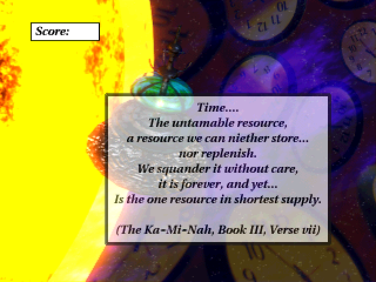

> Time....  
> The untamable resource,  
> a resource we can niether [sic] store...  
> nor replenish.  
> We squander it without care,  
> it is forever, and yet...  
> Is the one resource in shortest supply.
>
> (The Ka-Mi-Nah, Book III, Verse vii)

Shown if Garrit makes substantial progress toward another ending but runs out of time. Associated with "orbit altitude at condition \<number\>" (with the number counting down from 4 to 1) announcements made by SUZIE, the station's computer, over the public address system. At the end of the countdown, the station falls into the sun.

A bad ending.

### End Screen 2

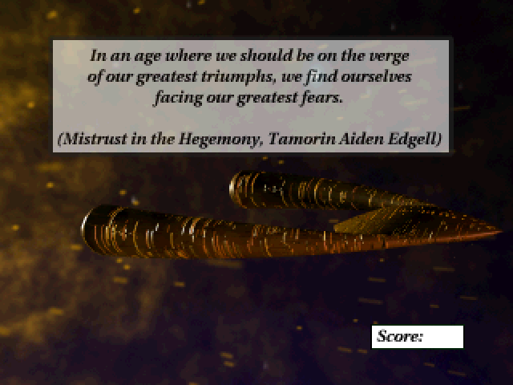

> In an age where we should be on the verge of our greatest triumphs, we find ourselves facing our greatest fears.
> 
> (Mistrust in the Hegemony, Tamorin Aiden Edgell)

Shown if Garrit doesn't save the life of the engineer in the bay at the start of the game and fails to solve the virtual reality "tumble maze" to which Azirra subsequently subjects him. This causes senator Aiden-Edgell to arrest Garrit on suspicion of being the political assassin ShatterJack.

A bad ending. The fate of the station isn't specified, but presumably without Garrit's intervention it falls into the sun following the senator's departure.

### End Screen 3

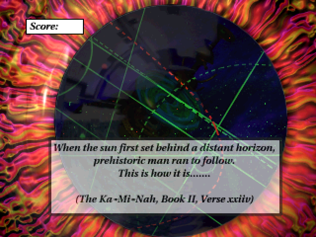

> When the sun first set behind a distant horizon, prehistoric man ran to follow.  
> This is how it is.......
> 
> (The Ka-Mi-Nah, Book II, Verse xxiiv)

Shown if Garrit saves Jacomo and helps him pilot/"navigate" the station to safety.

A good ending: the station is saved.

### End Screen 4

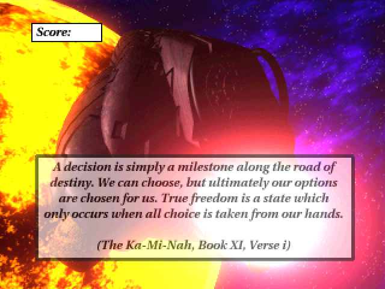

> A decision is simply a milestone along the road of destiny. We can choose, but ultimately our options are chosen for us. True freedom is a state which only occurs when all choice is taken from our hands.
> 
> (The Ka-Mi-Nah, Book XI, Verse i)

Shown if Garrit learns that he's the "digital messiah" and pilots the Web Runner into the sun, seemingly merging his consciousness with the sentient beings living inside it.

A good ending, although Garrit's body is destroyed and the fate of the station isn't specified.

### End Screen 5

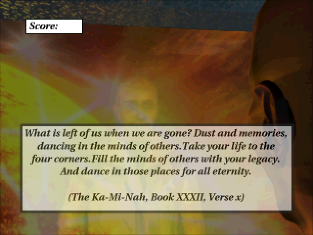

> What is left of us when we are gone? Dust and memories, dancing in the minds of others. Take your life to the four corners. Fill the minds of others with your legacy. And dance in those places for all eternity.
> 
> (The Ka-Mi-Nah, Book XXXII, Verse x)

Shown if Garrit learns that he's the "digital messiah" and uses Azirra's experimental mind transfer/duplication device (the "[anamnesis](https://en.wikipedia.org/wiki/Anamnesis_(philosophy)) cradle"; its aim is to temporarily store an individual's mind outside their body while the latter is de-aged) to copy his consciousness into the Web Runner, which is then flown into the sun.

A good ending, although the fate of the station isn't specified.

### End Screen 6

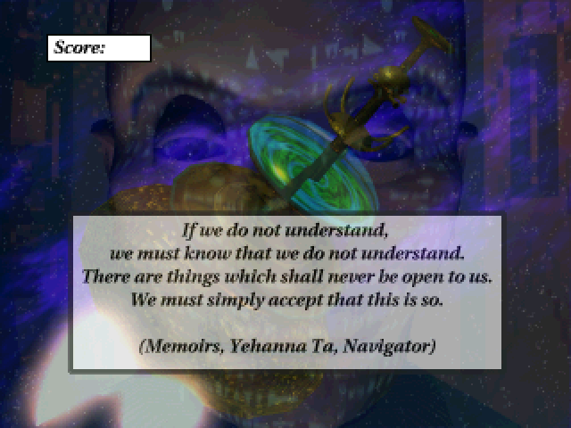

> If we do not understand, we must know that we do not understand.  
> There are things which shall never be open to us.  
> We must simply accept that this is so.
> 
> (Memoirs, Yehanna Ta, Navigator)

Shown if Garrit learns that sentient beings living in the sun are trying to communicate with the station, informs SUZIE of this fact, and helps her decode their message, which contains instructions for navigating the station away from the sun.

A good ending: the station is saved. [The associated cutscene](https://www.youtube.com/watch?v=Sz9bZa3hDi8&list=PLHUCGGa14mVTBoVyropgEHPKFF4xO1vEM&index=11) (in which Garrit screams "FRIEND!!!" at an exploding computer console while triumphant music plays) is particularly entertaining.

### End Screen 7

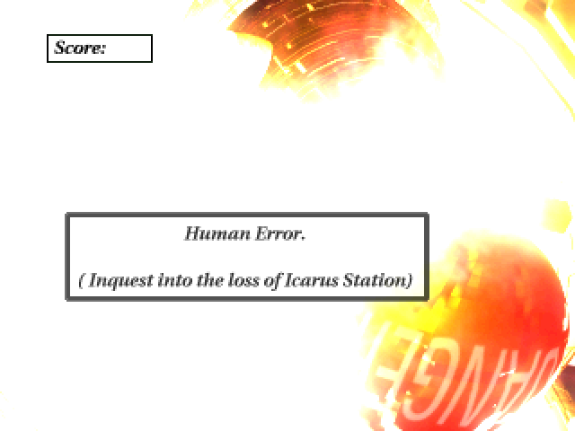

> Human Error.
> 
> (Inquest into the loss of Icarus Station.)

Shown for multiple endings that involve the station falling into the sun:
* Garrilac tries to correct the station's orbit (using "orbital correction procedure four-one-A") without Garrit's assistance.
* Garrit gets an orbit correction plan from Azirra, gives it to Garrilac, and either fails to learn that the plan is "bogus" or fails to inform Garrilac of this fact, causing Garrilac to use the bogus plan.
* Garrit helps a couple engineers prepare a missile, which they fire at the sun during a solar flare, hoping to create an explosion of sufficient power to propel the station away from the sun.

A bad ending.

### End Screen 8

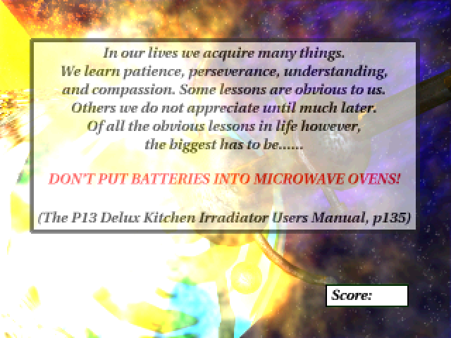

> In our lives we acquire many things. We learn patience, perseverance, understanding, and compassion. Some lessons are obvious to us. Others we do not appreciate until much later. Of all the obvious lessons in life, however, the biggest has to be......
>
> DON'T PUT BATTERIES INTO MICROWAVE OVENS!
>
> (The P13 Delux Kitchen Irradiator Users [sic] Manual, p135)

Shown after using the battery pack (found in room G1-141) on the microwave in room G3-251 three times.

A bad ending: the station falls into the sun (presumably microwaving the batteries causes a large explosion).

### End Screen 9

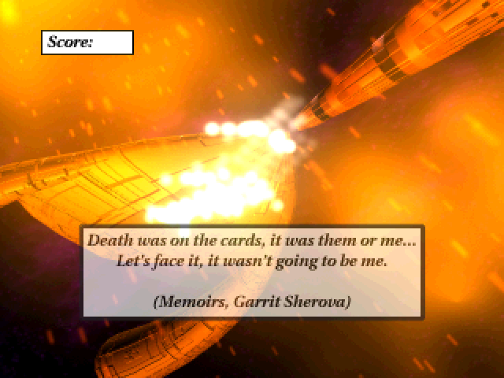

> Death was on the cards, it was them or me...  
> Let's face it, it wasn't going to be me.
> 
> (Memoirs, Garrit Sherova)

Shown if Garrit steals the senator's yacht and flees the station, apparently leaving everyone else to die.

A good ending for Garrit (who apparently lives long enough to write his memoirs); a bad ending for everyone else (assuming the station falls into the sun following Garrit's departure, which is a safe bet at this point).

### End Screen 10

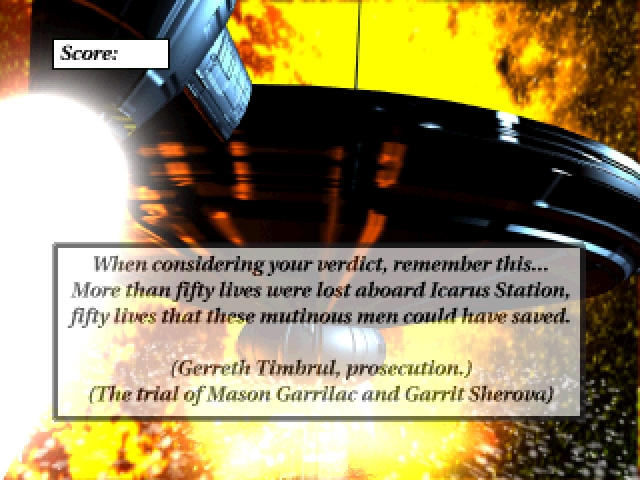

> When considering your verdict, remember this...  
> More than fifty lives were lost aboard Icarus Station, fifty lives that these mutinous men could have saved.
>
> (Gerreth Timbrul, prosecution.)  
> (The trial of Mason Garrilac and Garrit Sherova)

Shown for the mutiny ending in which Garrit and some of the engineering personnel escape in the station's escape pod/deck (after forcing the visiting senator to give them the launch key), apparently leaving everyone else to die.

A bad ending for everyone: Garrit and the engineers escape, but are tried for mutiny, while everyone else on the station perishes when it falls into the sun (which is shown in the associated cutscene). It's possible the senator and his staff may escape in his yacht before this ending.

### End Screen 11

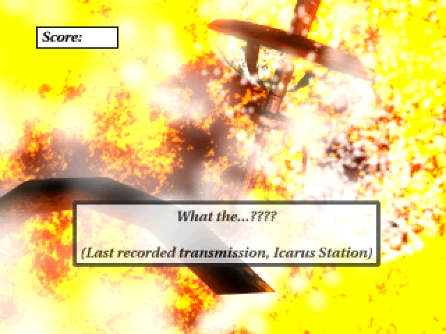

> What the...????
> 
> (Last recorded transmission, Icarus Station)

Shown after pressing the big red button labelled "DO NOT PUSH" on the ceiling of room E3-162.

A bad ending; pushing the big red button results in the station falling into the sun.

### End Screen 12

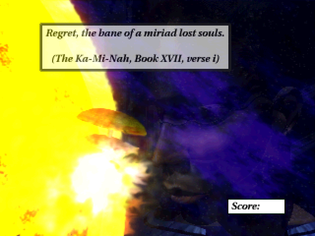

> Regret, the bane of a miriad [sic] lost souls.
> 
> (The Ka-Mi-Nah, Book XVII, verse i)

Shown if Garrit finds evidence showing that Jurell murdered the captain before the events of the game, tells Jurell about this evidence, and is detained by Jurell. Without Garrit's intervention, the station falls into the sun.

A bad ending.

### End Screen 13

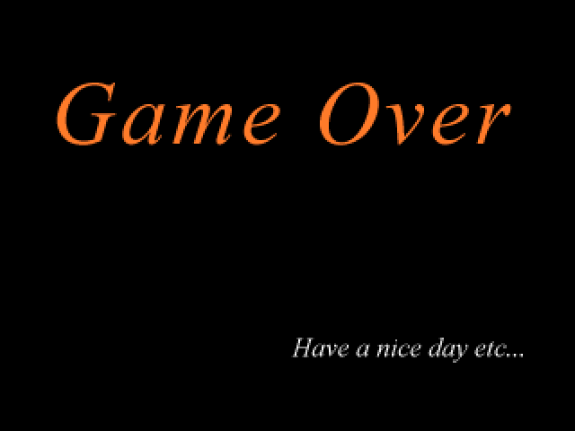

> Game Over
> 
> Have a nice day etc...

Appears to be unused. Likely a placeholder left over from development.
